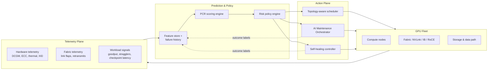
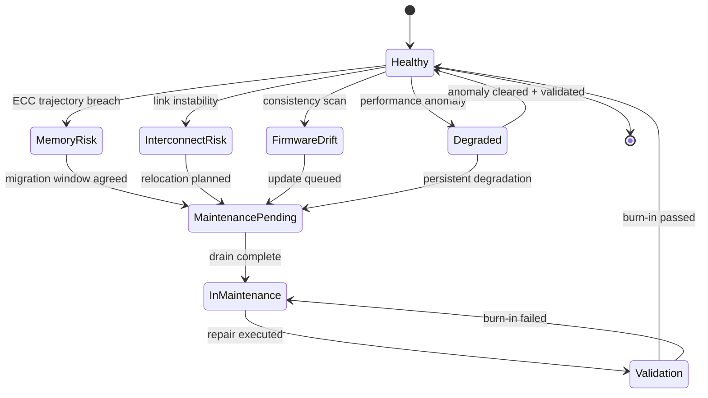
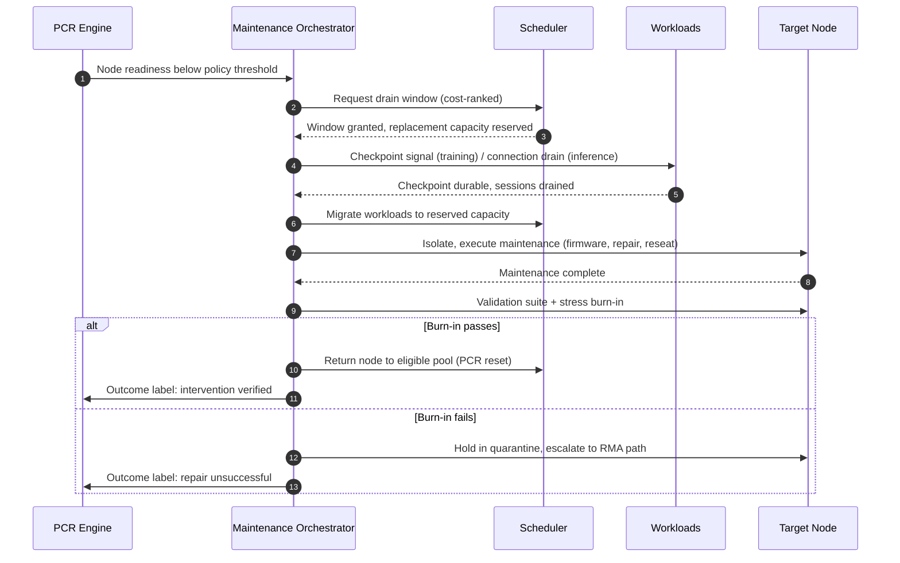
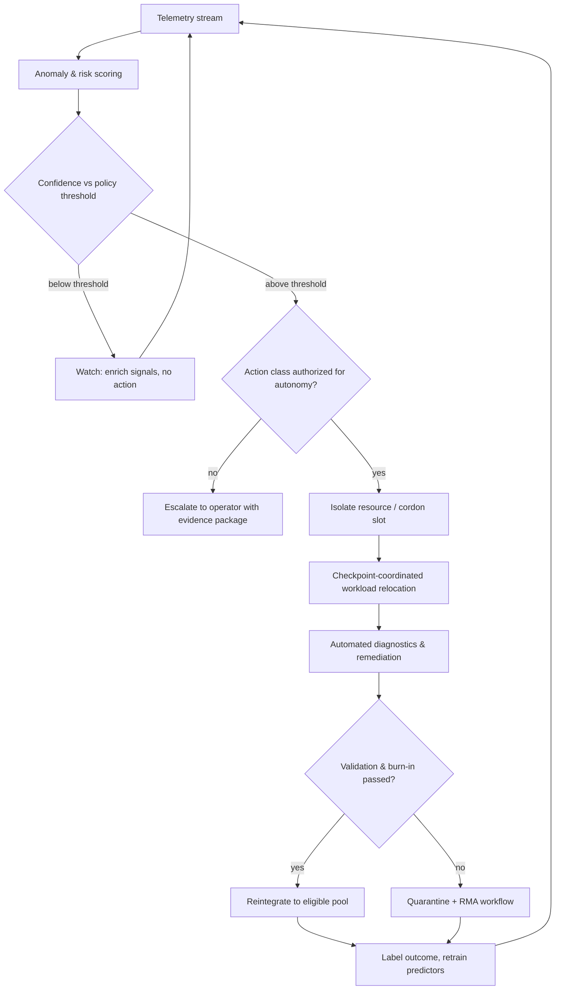
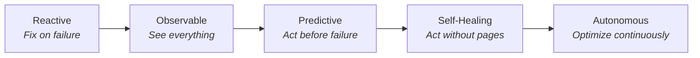

# Why GPU Infrastructure Needs Reliability Engineering

### Applying Predictive Operations, Self-Healing Infrastructure and Autonomous Maintenance to AI Clusters

**Author: Sudeept Srivastava**

---

## Executive Summary

AI infrastructure is rapidly becoming the backbone of modern software, and the industry's attention remains fixed on the wrong bottleneck. GPU supply, model capability and interconnect bandwidth dominate the conversation, while the constraint that actually determines whether an AI platform earns enterprise trust — operational reliability — is treated as an afterthought to be handled by whoever is on call.

The numbers argue otherwise. Meta's published account of Llama 3 405B pre-training recorded 419 unexpected job interruptions across a 54-day run on 16,384 H100 GPUs — an interruption roughly every three hours, with about 78% attributed to hardware. That is not an outlier; it is the expected behavior of any sufficiently large GPU fleet, and it is the reason training "goodput" (useful work as a fraction of paid capacity) has become the metric sophisticated operators actually manage to.

This paper argues that GPU infrastructure has reached the point that virtualized enterprise infrastructure reached fifteen years ago: the era when heroic manual operations stopped scaling, and the discipline of reliability engineering had to be productized. It proposes a reliability-first operating model built on three frameworks:

- **Predictive Compute Readiness (PCR)** — a dynamic, telemetry-derived readiness score that replaces binary "available/unavailable" scheduling with risk-aware placement.
- **GPU Resource Health (GRH)** — a customer-facing health state model that makes degradation visible, actionable and contractual rather than hidden behind a green dashboard.
- **AI Maintenance Orchestrator (AMO)** — an autonomous workflow layer that plans, sequences and verifies maintenance the way a scheduler plans workloads.

Together these move an organization along a deliberate maturity curve — Reactive → Observable → Predictive → Self-Healing → Autonomous — and reframe reliability from an operations cost center into a product capability that wins enterprise workloads.

---

## 1. The Reliability Gap

### 1.1 Why GPU fleets fail differently

Classical infrastructure reliability was built around a convenient fiction: servers are independent, failures are uncorrelated, and redundancy absorbs the rest. GPU clusters violate every clause of that fiction.

A large training job is a single distributed computation with tight synchronization. One failed GPU among sixteen thousand does not degrade the job by 0.006% — it stops the job, forces a rollback to the last checkpoint, and burns the work of every healthy accelerator in the collective. Failure impact is not proportional to failure scope; it is amplified by synchronization. This is the structural reason GPU reliability cannot be inherited from CPU-era practices.

The failure taxonomy is also broader than node-down:

| Failure class | Typical signals | Why traditional monitoring misses it |
|---|---|---|
| GPU memory degradation (HBM) | Rising correctable ECC rates, row-remap exhaustion | Correctable errors look "handled" until they aren't; the single largest hardware interruption class in Meta's Llama 3 run |
| Interconnect instability | NVLink/NVSwitch errors, InfiniBand link flaps, rising retransmits | Job slows rather than fails — surfaces as a "straggler," not an alert |
| Thermal events | Throttling, clock drift, cooling anomalies | Node stays "up" while silently computing slower |
| Firmware and driver drift | Version skew across fleet, XID error patterns | Each node passes health checks individually; the *fleet* is inconsistent |
| Storage and data-path contention | Checkpoint write stalls, dataloader starvation | Manifests as GPU idle time, blamed on the workload |
| Scheduling fragmentation | Stranded capacity, topology-blind placement | Every GPU is "healthy," yet the cluster can't place the job |
| Silent data corruption (SDC) | Numerically wrong results with no fault raised | By definition invisible to symptom-based monitoring |

The last row deserves emphasis. Hyperscale operators (Google and Meta have both published on this) have documented fleets containing "mercurial cores" and GPUs that produce incorrect results without raising any error. In AI training, SDC does not crash anything — it silently poisons gradients. Only proactive, adversarial health validation catches it.

### 1.2 The MTBF arithmetic nobody escapes

Take an optimistic per-GPU mean-time-between-failures of 5 years. At 16,000 GPUs, the fleet-level MTBF collapses to roughly 2.7 hours — almost exactly what Meta observed empirically. Reliability at AI scale is not a quality problem to be engineered away component by component; it is a statistical certainty to be *managed*. The question is never "will something fail today" but "how much service impact will today's failures cause" — and that question is answerable only with prediction, orchestration and automation.

### 1.3 The economic stakes

A modern 8-GPU H100-class node represents roughly $300–400K of capital, and rented capacity runs $2–4 per GPU-hour at market rates. On a 16K-GPU cluster, one hour of stalled training is $50–100K of burned capacity — before counting the opportunity cost of delayed model launches, which for frontier labs is measured in market position rather than dollars. Enterprises evaluating AI platforms have begun asking the questions they learned to ask of virtualization platforms: What is your maintenance experience? What are your health SLOs? Can I see degradation before it becomes my outage? Vendors without answers will lose those workloads to vendors with them.

---

## 2. Reference Architecture

The operating model proposed in this paper is a closed loop: telemetry feeds prediction, prediction drives both scheduling and maintenance, and every action feeds back as labeled training data for the predictive layer.



Three design commitments distinguish this from a conventional monitoring stack. First, the scheduler consumes *risk*, not just availability. Second, maintenance is a planned, orchestrated workload — a first-class citizen of the scheduler, not an interruption to it. Third, the loop is closed: every remediation outcome becomes labeled data, so the predictive layer improves with fleet age instead of decaying.

---

## 3. Predictive Compute Readiness (PCR)

### 3.1 From availability to readiness

Every scheduler in production today asks a binary question: is this GPU available? PCR replaces it with a graded one: how likely is this GPU to complete the next N hours of work without service impact?

Each GPU (and each aggregation above it — node, rail, pod) carries a continuously updated readiness score composed of weighted signal families:

```
PCR = w1·H + w2·F + w3·W + w4·T + w5·M + w6·X

H  Hardware health      ECC trends, row-remap headroom, thermal margin, power anomalies
F  Fabric health        link error rates, flap history, congestion exposure
W  Workload fit         historical behavior of this hardware under this workload class
T  Topology quality     placement distance, switch-tier risk, blast-radius exposure
M  Maintenance posture  firmware currency, pending advisories, time since validation
X  Failure history      node lineage, batch/SKU correlation, prior repair recurrence
```

The weights are not universal constants — they are learned per fleet and per workload class, which is precisely the point. A GPU with rising correctable ECC may be perfectly acceptable for stateless inference (low checkpoint cost, fast eviction) and unacceptable for a slot in a 4,096-GPU training collective (maximum blast radius). Readiness is contextual; availability never was.

### 3.2 What scheduling on readiness changes

- **Long-horizon training jobs** get placed on the highest-PCR hardware with topology-aware bin-packing, because their cost-of-interruption is extreme.
- **Interruption-tolerant workloads** (batch inference, evaluation runs, data processing) absorb the medium-PCR band — capacity that would otherwise be either wasted or dangerously placed.
- **Low-PCR hardware** is proactively drained into the maintenance pipeline *before* it fails, converting an unplanned 3 a.m. interruption into a planned, checkpoint-coordinated migration.

The fleet-level effect is a quiet but compounding one: failures increasingly happen to empty or low-value slots. The failure rate doesn't change. The *service impact* does.

### 3.3 Honest limits

Prediction earns its keep only if its precision is managed. A predictive drain with a 30% true-positive rate is a capacity tax, not a reliability win. PCR systems must publish their own operating metrics — precision/recall of failure predictions, capacity withheld, interruptions avoided — and be tuned against the fleet's real economics. Prediction is a portfolio decision: you are trading a known, small capacity cost for a probabilistic, large interruption cost. Treat it with the same rigor as any portfolio.

---

## 4. GPU Resource Health (GRH)

### 4.1 Health as a contract, not a dashboard

Enterprise infrastructure learned long ago that a binary up/down signal is useless to customers running serious workloads. Virtualization platforms exposed rich health and maintenance semantics — and enterprises built operational muscle around them. GPU platforms mostly have not, which is why an AI customer's first sign of trouble is so often their own job crashing.

GRH defines a small, stable vocabulary of customer-visible states:

| State | Meaning | Customer-visible commitment |
|---|---|---|
| **Healthy** | All signals in normal bands | Full SLO applies |
| **Degraded** | Performance-affecting anomaly (thermal throttle, fabric congestion) | Advisory + migration assistance offered |
| **Memory Risk** | ECC/remap trajectory approaching threshold | Scheduled migration window proposed |
| **Interconnect Risk** | Link instability detected on serving path | Topology-preserving relocation planned |
| **Firmware Drift** | Node out of fleet consistency band | Non-urgent maintenance queued |
| **Maintenance Pending** | Drain scheduled, countdown published | Checkpoint coordination API active |
| **Capacity Constrained** | Healthy but topology-stranded | Placement advisory only |

### 4.2 The state machine



Two properties matter more than the specific states. **Transitions are evidence-gated** — a node returns to Healthy only through validation and burn-in, never by timer or operator assertion, which is the discipline that catches repair-induced faults and silent data corruption. And **states carry commitments** — each state maps to a defined customer experience (notice periods, migration assistance, SLO treatment), which converts health from an internal signal into a product surface.

### 4.3 Why transparency wins commercially

The counterintuitive lesson from enterprise cloud: exposing degradation *increases* customer trust. Sophisticated customers already suspect the fleet is imperfect; what they cannot forgive is discovering it through their own outage. A platform that says "this capacity carries memory risk; here is your coordinated migration window" is a platform an enterprise architect can defend to their CIO. Health transparency is a sales asset dressed as an engineering artifact.

---

## 5. AI Maintenance Orchestrator (AMO)

### 5.1 Maintenance as a scheduled workload

In immature fleets, maintenance competes with workloads; in mature fleets, maintenance *is* a workload — planned, prioritized, capacity-aware and verified. The AMO treats every maintenance action as a job with dependencies, cost, and a verification gate.



### 5.2 The orchestration principles

**Sequence by blast radius, not by ticket age.** A firmware update on a spine-adjacent node during a 10K-GPU training run and the same update on an idle inference node are entirely different risk decisions. The orchestrator ranks pending maintenance by service-impact cost, not FIFO.

**Coordinate with the workload, not around it.** For training, that means checkpoint-aligned drains — the orchestrator waits for (or requests) a durable checkpoint before migration, converting a rollback-hours event into a rollback-minutes one. For inference, it means connection draining and warm capacity pre-staged before the first session moves.

**Verify before returning capacity.** A meaningful share of "repaired" hardware fails again quickly — repair itself is a risk event. Every returned node passes a validation suite (compute correctness, memory stress, fabric loopback, thermal soak) before rejoining the eligible pool. No verification, no return. This single gate is the cheapest SDC defense a fleet can buy.

**Batch intelligently.** Fleet consistency work (firmware waves) is planned like a rolling deployment: canary cohort, bake time, automatic halt on regression signals — the same discipline software delivery learned a decade ago, applied to the substrate.

---

## 6. Self-Healing Operations

### 6.1 The autonomy loop

Self-healing is the AMO running without a human in the loop for a bounded, pre-authorized class of actions:



### 6.2 Autonomy is earned, not declared

The credible path to self-healing is a widening circle of pre-authorized actions, each admitted only after its manual equivalent has demonstrated high precision:

1. **Recommend-only.** The system proposes; operators act. Precision is measured.
2. **Auto-execute reversible actions.** Cordoning, draining to reserve capacity, re-running diagnostics — actions whose worst case is wasted capacity, never data loss.
3. **Auto-execute corrective actions** (resets, firmware rollbacks, slot retirement) within budget guardrails: maximum concurrent autonomous drains, maximum capacity withheld, automatic halt on anomaly clustering.
4. **Autonomous fleet posture** — the system manages readiness as a continuous optimization, with humans supervising policy, not events.

Every autonomous action must leave a human-readable evidence trail — what was observed, what was predicted, what was done, what it cost, whether it worked. Autonomy without auditability is how operators lose trust in a week what took a year to build. The budget guardrails matter for a subtler reason too: a miscalibrated predictor plus unbounded autonomy is a self-inflicted outage machine. Bound the blast radius of your own automation exactly as you bound the hardware's.

---

## 7. Reliability Maturity Model



Each stage has a defining question, a characteristic KPI set, and a trap.

**Reactive.** *Question: what broke?* KPIs: MTTR, ticket volume. The trap is heroism — a strong on-call culture masks the absence of a system, and the best engineers burn out first.

**Observable.** *Question: what is happening?* KPIs: telemetry coverage (% of failure classes with a leading signal), detection latency, straggler identification time. The trap is dashboard theater — collecting signals nobody acts on. Coverage of *failure classes*, not metric count, is the honest measure.

**Predictive.** *Question: what will break?* KPIs: prediction precision/recall, interruptions avoided, capacity withheld by prediction, training goodput. The trap is unaccounted false positives — prediction that quietly taxes capacity while claiming credit for avoided failures nobody can verify. Publish the confusion matrix or don't claim the stage.

**Self-Healing.** *Question: what resolved itself?* KPIs: % of incidents remediated without human action, autonomous-action precision, evidence-trail completeness, page volume per PB-hour of training. The trap is silent scope creep — autonomy expanding faster than its demonstrated precision.

**Autonomous.** *Question: is the fleet continuously optimal?* KPIs: sustained goodput (frontier operators publish ~90% as the achievable bar), effective cost per useful FLOP, human interventions per month. The trap is complacency — the predictors themselves drift as hardware generations, workloads and firmware change. The loop must keep learning or the stage regresses.

Organizations should locate themselves honestly (most GPU operators today sit between Reactive and Observable), pick the KPI set for the *next* stage, and resist the vendor-driven temptation to buy Stage 5 tooling for a Stage 1 operating culture. Maturity is an operating model, not a procurement.

---

## 8. Product Strategy: Reliability as a Capability, Not a Cost Center

The deepest shift this paper argues for is organizational. In most infrastructure organizations, reliability work is invisible when it succeeds and career-defining when it fails — the incentive structure of a cost center. Platforms that win enterprise AI workloads will invert this by treating reliability as a product surface with a roadmap, owned jointly by engineering, product management and operations.

Concretely, that means:

**Customer-facing SLOs that match how AI workloads actually fail.** Node-level availability is nearly meaningless to a training customer; what they need contracted is *interruption experience* — interruption frequency per 1,000 GPU-days, mean recovery time to resumed training, checkpoint-coordination guarantees, maintenance notice periods. Define the SLOs customers can architect against, then publish attainment.

**Maintenance experience as a designed journey.** Notice, scheduling flexibility, checkpoint coordination APIs, migration assistance, post-maintenance validation reports. Enterprises don't fear maintenance; they fear *surprise*. A well-designed maintenance experience converts a churn risk into a renewal argument.

**Telemetry quality as an engineering deliverable.** Every failure class in Section 1's taxonomy should have a named leading indicator, an owner, and a coverage test. Signal gaps are backlog items, prioritized by the service impact they leave invisible.

**An automation roadmap with published guardrails.** The maturity model becomes the roadmap: which action classes gain autonomy this quarter, at what demonstrated precision, within what budget guardrails. Customers evaluating the platform can read where it is and where it is going — which is itself a differentiator, because almost nobody publishes this.

**Reliability economics in the business case.** Goodput improvements, avoided-interruption value and maintenance-efficiency gains translate directly to effective $/FLOP — the number CFOs ultimately compare. A reliability team that can state its impact in effective capacity delivered will never again have to defend its existence in a budget cycle.

---

## Conclusion

The GPU industry is re-learning, at compressed speed, the lesson enterprise infrastructure learned over two decades: capability wins benchmarks, but reliability wins production. As clusters grow from thousands to hundreds of thousands of accelerators, failure stops being an event and becomes a permanent operating condition — and the platforms that thrive will be those that made that condition boring.

The path is neither mysterious nor optional: instrument every failure class, schedule on readiness rather than availability, make health an honest customer contract, orchestrate maintenance as a first-class workload, earn autonomy one action class at a time, and manage the whole system to goodput and effective cost per useful FLOP. Predictive operations, intelligent maintenance orchestration and self-healing infrastructure are not futurism — every element exists in production somewhere today. What is rare is the operating model that composes them deliberately.

Reliability engineering made the cloud trustworthy enough to run the world's enterprises. The same discipline, applied with the adaptations this paper describes, is what will make AI infrastructure trustworthy enough to run whatever comes next.

---

## Author's Note

The concepts presented are intended as original architectural viewpoints informed by two decades of experience across enterprise infrastructure, cloud platform reliability, observability/AIOps and infrastructure product management. They are technology-agnostic design proposals rather than descriptions of any specific employer's internal systems. Public incident data referenced (including Meta's Llama 3 infrastructure retrospective) is drawn from published research and industry reports.

## References & Further Reading

1. Meta AI — *The Llama 3 Herd of Models* (2024): infrastructure reliability appendix documenting 419 interruptions over 54 days of 405B pre-training on 16,384 H100 GPUs.
2. ByteDance — *MegaScale: Scaling Large Language Model Training to More Than 10,000 GPUs* (NSDI 2024): straggler diagnosis and fault tolerance at 10K+ GPU scale.
3. Google — *Cores that don't count* (HotOS 2021) and Meta — *Silent Data Corruptions at Scale* (2021): the silent data corruption literature.
4. NVIDIA DCGM documentation: GPU telemetry, XID error taxonomy and health diagnostics.
5. Google SRE — *Site Reliability Engineering* (O'Reilly): error budgets and the automation maturity philosophy this paper adapts to GPU fleets.
